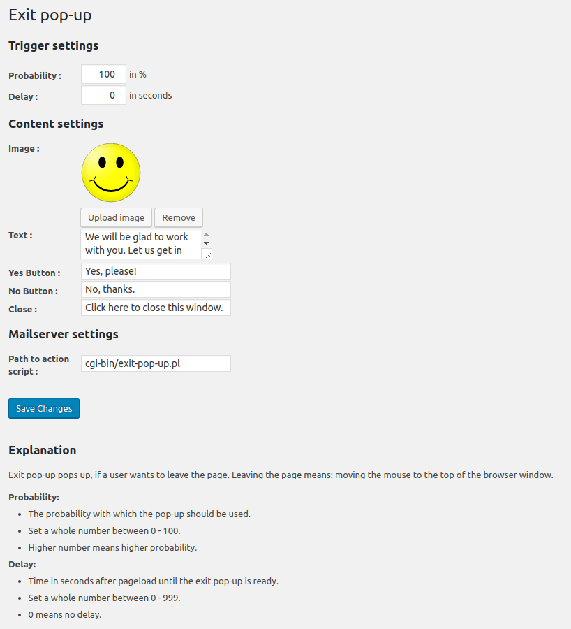
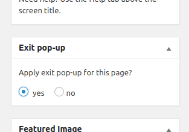
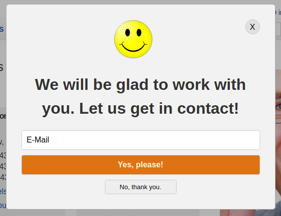

# Exit pop-up
WordPress Plugin: Display modal window on top of the page before user leave.

## Description

_Exit pop-up_ pops up, if:
1. User leave the page. Leaving the page means: moving the mouse to the top of the browser window.
2. User click on an Link to an external website.

Features:

- Fires ppop-up only one time.
  - Remember action in local storage from the browser.
- Fires only for not logged-in users.
- Tracking API
  - Design variant
  - Time of delay
  - Browser version
  - Click status: 
    - Submit button 
    - Cancel button
    - Click on "X" button (top right corner)
    - Click somewhere outside the pop-up 
- After submit:
  - The form will be hidden and a "thank you" text appears
  - Popup will be hidden after 3 seconds
- Set the probability with which the pop-up should be used.
- Set delay time after pageload until the exit pop-up is ready.
- Pops up only on predetermined pages.
- Use your own individual stylesheet.
- Set random style variants if you want.
- Web-Performance friendly: 
  - No rendering blocking
  - no heavy code
  - asynchronous loading
- Vanilla JavaScript
  - compatible to Internet Explorer 9

Note:
This plugin sets an entry in the local storage of the browser to "remember" if the pop-up was fired. In some country's you have to declare that. E.g. in your privacy disclaimer.

## Installation

1. Upload `exit-pop-up.php` to the `/wp-content/plugins/` directory.
1. Activate the plugin through the `Plugins` menu in WordPress.
1. Make global configuration trough `Settings` > `Exit pop-up` menu in WordPress.
1. Edit page and apply _Exit pop-up_ in meta box on any page you want.

## Frequently Asked Questions

Until now nobody has asked. :-)

## Screenshots

Admin page for global configurations.

Meta box for settings per post or page.

Exit pop-up example.

## Changelog

= 1.1.0 =
- Tracking possible also when canceling
- Different variants ot the pop-up design can be created and used
- Shuffling between this variants
- More tracking:
  - Wich design variant
  - Time of delay
  - Browser version
  - Status (submit vs. canceling)
- After submit:
  - The form will be hidden and a "thank you" text appears
  - Popup will be hidden after 3 seconds

= 1.0.0 =
- init